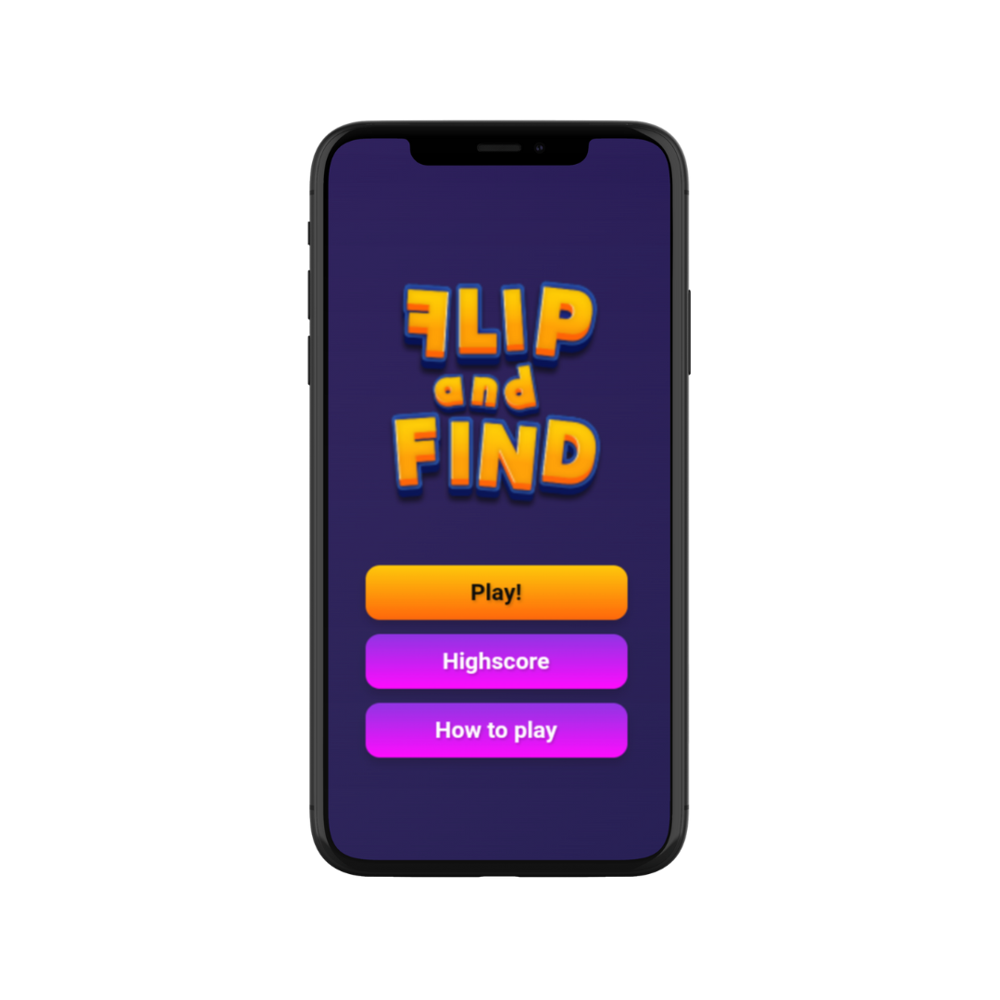

# Flip and Find

Flip and Find is a fun and interactive memory card mobile-game built using Cordova. The goal is simple: flip cards and try to find all matching pairs within the fewest number of moves!

## Features

- **Easy to play**: Intuitive controls for flipping cards.
- **Responsive design**: Playable on mobile devices and desktops.
- **Difficulty levels**: Varying levels of difficulty with fewer flip counter and more complex image on cards.
- **Flip counter**: Keep track of your performance and challenge yourself to improve.

## Contributing

We welcome contributions from the community. To contribute:

1. Fork the repository.
2. Create a new branch (`git checkout -b feature-branch`).
3. Make your changes and commit them (`git commit -m 'Add some feature'`).
4. Push to the branch (`git push origin feature-branch`).
5. Open a Pull Request.

Please ensure your code adheres to our coding standards and includes relevant tests.

## Contact
For any questions, suggestions, or feedback, please contact me at:
- Email: airaestur@gmail.com
- Socials: linktr.ee/airaestur
